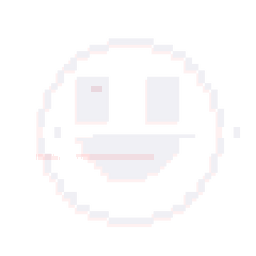

<p align="center">
  
</p>

<h1 align="center">TORMENT_NEXUS</h1>

<p align="center">
  <strong>A local-first voice AI companion, tool system, and systems-art project.</strong>
</p>

<p align="center">
  <a href="#installing-the-windows-beta">Install on Windows</a> |
  <a href="#your-first-launch">First launch</a> |
  <a href="#what-it-can-do">What it can do</a> |
  <a href="#choose-the-right-guide">All guides</a>
</p>

<p align="center">
  <a href="https://github.com/elfdev-tormentnexus/TORMENT_NEXUS/releases/tag/v0.1.0-beta.3">
    Download the latest beta: v0.1.0-beta.3
  </a>
</p>

> [!IMPORTANT]
> **Want to use TORMENT_NEXUS on Windows? Do not use GitHub's green
> `Code` button or its automatic `Source code` downloads.** Those files are
> for developers and do not contain the AI model or self-contained Windows
> runtime. Follow the Windows instructions below and download the four named
> release files.

## Installing the Windows beta

You do not need to know how to code. The ready-to-run Windows beta includes its
own Python runtime, AI model, voice files, and installer. You do not need to
install Python, use a command line, create an account, supply an API key, or
download a separate model.

### Before you start

| You need | Why |
| --- | --- |
| 64-bit Windows | The current packaged beta is built for 64-bit Windows. |
| About 10 GB of free space during installation | The two download parts, rebuilt ZIP, and extracted folder temporarily exist together. The installed folder is about 3 GB. |
| At least 8 GB of memory | 8 GB is comfortable for text use; 16 GB is better when using voice at the same time. |
| Internet for the download | Setup and ordinary conversation work locally after the files are downloaded. |
| A microphone only if you want to speak | Typed input and spoken replies still work without a microphone. |

### Four installation steps

1. Open the
   [v0.1.0-beta.3 release page](https://github.com/elfdev-tormentnexus/TORMENT_NEXUS/releases/tag/v0.1.0-beta.3)
   and expand **Assets** if the file list is hidden.
2. Download all four of these files into the same folder:
   - `TORMENT_NEXUS.zip.part01`
   - `TORMENT_NEXUS.zip.part02`
   - `TORMENT_NEXUS_v0.1.0-beta.3_MUSIC_VISUALIZER_PATCH.zip`
   - `INSTALL_TORMENT_NEXUS_BETA3_WITH_MUSIC_PATCH.bat`
3. Double-click `INSTALL_TORMENT_NEXUS_BETA3_WITH_MUSIC_PATCH.bat`. It checks
   the original download, extracts the app, installs the visualizer repair,
   and starts the normal offline setup. Leave the window open until it says
   setup is complete.
4. Launch **TORMENT_NEXUS** from the new desktop shortcut.

Setup is offline and normally takes only a few minutes. It changes nothing in
your system Python, PATH, or registry. Everything stays in the extracted
folder, apart from the desktop shortcut.

Already installed Beta 3? Download only the music visualizer patch ZIP,
extract it, close TORMENT_NEXUS, and double-click
`APPLY_MUSIC_VISUALIZER_PATCH.bat`. It backs up the original files before
repairing them.

For the manual `REASSEMBLE_TORMENT_NEXUS.bat` route, checksum details, Windows
security messages, or anything that does not match these steps, use the
[complete Windows installation guide](docs/INSTALL_WINDOWS.md).

## Your first launch

The first message can take a little longer while the local model loads into
memory. This is normal.

Type:

```text
tutorial
```

The tutorial shows two short topics at a time. Type `next`, `n`, or `continue`
to move forward. You can restart it later with `tutorial restart`.

These are useful first commands:

```text
help              show available commands
health check      explain what is working on this computer
voice status      check voice and microphone readiness
music library     list local songs
text mode         turn spoken replies off
audio mode        turn spoken replies back on
```

Read [Your first session](docs/FIRST_RUN.md) for a friendly tour of
conversation, voice, memory, music, the visualizer, time awareness, and long
answers.

## What it can do

- Hold local conversations using the included language model.
- Accept typed input at all times and optionally listen through a microphone.
- Speak replies through an offline voice.
- Remember selected facts in visible local files that can be reviewed or
  removed.
- Read the computer's local clock during each reply, allowing it to understand
  the current date and time, session length, and the gap since the previous
  conversation.
- Notice what is happening on the computer around it: which application is in
  front, how long you have been away from the keyboard, and how hard the
  machine is working. It may remark on this during a long silence.
- Accept an explicitly enabled, experimental **desktop Wi-Fi sensing** result
  from a separate local research collector. This is disabled by default and
  is limited to a coarse radio-activity state, never a camera-like view.
- Find and play music placed in its local music folder, including casually
  typed song names, and keep playing through the library on its own.
- Display a glossy Y2K music visualizer with ten rotating scenes and
  colours, all reacting to the music.
- Show long replies one page at a time so instructions do not disappear above
  the screen.
- Optionally connect to separately configured web search, Spotify, Raspberry
  Pi, and Meshtastic hardware features.
- Offer guarded, reviewable project-editing tools for advanced users.

TORMENT_NEXUS is software with a deliberately stylized identity. Neither time
awareness nor activity awareness means it watched, waited, thought, worked,
felt, or remained conscious. Both are records of things a sample or a
timestamp recorded, and it is written to describe them that way.

### Activity awareness and your privacy

This feature is on by default and worth understanding before you use it.

Every twenty seconds it notes which application is in front, that window's
title, how long since you touched the keyboard, and the machine's load and
battery. Window titles often contain the name of the file you have open, the
page you are reading, or who you are talking to.

- It is kept in `assistant\memory\activity_log.jsonl` for two weeks and then
  discarded automatically.
- It never leaves this computer, and it is excluded from the release package
  and from anything you would attach to a bug report.
- `activity` shows what it has noticed.
- `activity off` stops it and clears what it had.
- `activity forget` deletes the stored history immediately.

To change how long it is kept, set `TORMENT_NEXUS_ACTIVITY_RETENTION_DAYS`.
Setting it to `0` means the file is discarded the next time TORMENT_NEXUS
starts, so nothing carries from one session to the next.

### Experimental Wi-Fi sensing

This is a desktop research seam, not a ready-made Windows feature. The
installed Intel AX211 driver does not give TORMENT_NEXUS a normal supported
way to collect Wi-Fi channel-state data, so the program will never alter your
adapter, load a driver, transmit radio traffic, or begin a capture by itself.

If a separately authorised **local** experiment eventually produces a small
aggregate status record, set `TORMENT_NEXUS_WIFI_EXPERIMENT_FILE` to that
file and use `wifi sensing on`. The only accepted results are `unknown`,
`still`, `motion`, and `approach`, with a short expiry and a coarse confidence
level. No raw CSI, packet data, SSIDs, device addresses, identity, range
trace, or sensing history is accepted or retained by TORMENT_NEXUS. Use
`wifi sensing status`, `wifi sensing off`, and `wifi sensing forget` to
inspect or clear its in-memory reading.

Treat it as a consent-based room-activity experiment in your own space—not a
camera, person detector, or a way to see through walls.

The exact collector contract and the separate calibration gate are in
[Experimental desktop Wi-Fi sensing](docs/WIFI_SENSING_EXPERIMENT.md).

## Local by default, connected by choice

| Feature | What leaves the computer? |
| --- | --- |
| Conversation, model, memory, and speech | Nothing by default. These run locally. |
| Time awareness | Nothing. It reads the computer's clock and saved conversation timestamps. |
| Activity awareness | Nothing. Window titles and machine load are sampled into a local file kept for two weeks, excluded from releases, and erased by `activity forget`. |
| Experimental Wi-Fi sensing | Nothing. Disabled unless a local aggregate-only experiment is configured; no radio capture, raw samples, or history is handled by the app. |
| Local music and visualizer | Nothing. Songs stay in the local music folder. |
| Web search | Search text leaves the computer only when optional SearXNG search is configured and used. |
| Spotify search | The search text is sent to MusicBrainz for public song metadata, then opened in the installed Spotify app. |
| Hardware | Nothing unless optional hardware is deliberately configured and used. |
| Project editing | Changes are limited by local Python guardrails and review steps. |

The release package starts with no maintainer conversation history, saved
memories, music, passcode, API key, or paired device information.

## Voice

TORMENT_NEXUS begins in audio mode by default. You can still type while it is
listening or speaking.

- `text mode` turns spoken replies off.
- `audio mode` turns spoken replies back on.
- `voice status` reports whether voice and microphone features are ready.
- **Escape** cancels current speech or listening.

A microphone is optional. Without one, you can type and still hear spoken
answers. See [Voice setup and controls](assistant/voice/README.md) for source
setup and advanced voice options.

## Local music and visualizer

Put your own MP3, WAV, FLAC, or OGG files in:

```text
assistant\music
```

Then type `music library` or `play <part of the song name>`. Starting a local
song automatically opens the full-screen visualizer. The confirmation is
displayed silently so the voice does not talk over the opening.

In music mode:

| Key | Action |
| --- | --- |
| Left / Right | Change visualizer scene |
| Space | Play the next local song |
| `[` / `]` | Lower / raise local-song volume |
| Ctrl+B | Leave music mode |

There are ten scenes: the aqua player, radial tunnel, spectrum cathedral,
orbital reactor, corrupt cube, neon horizon, plasma flow, datastream rain,
wormhole, and acid lattice. The aqua player is the default: a black-glass,
chrome-rimmed oscilloscope and gel-meter display. Scenes rotate every 2 minutes 45 seconds,
so a full pass takes about 28 minutes, and colours change automatically every
20 seconds. Use Left and Right to reach one without waiting.

Acid lattice is an original acid-green triangulated mesh, cut by jagged voids
and beat fracture bursts, inspired by the supplied music video's visual
language without using any footage.

Space affects local music only; it does not control Spotify or browser audio.
Each scene gives different emphasis to bass, beats, melody, treble, stereo
movement, and the real waveform for larger, more dramatic changes.

Local-library repeat is on by default. When a local song ends, the next
filename in the library starts automatically; after the last song, playback
returns to the first. Type `repeat music off` to stop after the current song,
`repeat music on` to restore the loop, or `repeat music` to check its status.

## Choose the right guide

### I want to use the Windows beta

Start with [Installing on Windows](docs/INSTALL_WINDOWS.md), then read
[Your first session](docs/FIRST_RUN.md). If something goes wrong, open
[Troubleshooting](docs/TROUBLESHOOTING.md).

### I want to test the beta

Read the [beta guide](docs/BETA_GUIDE.md) for scope and privacy, followed by
the [testing guide](docs/TESTING.md) for a repeatable test pass and useful bug
reports.

Developers can run the complete Windows regression suite with:

```powershell
.\setup\test_assistant.bat
```

### I want to work on the source

A normal Git clone is not the ready-to-run Windows package. Developers must
provide Python 3.14, the dependencies in `setup/requirements.txt`, a compatible
`llama-server` build from llama.cpp, and a local GGUF model file. A GGUF is the
file containing the local language model.

See [Bring your own GGUF](docs/BRING_YOUR_OWN_GGUF.md) and
[Architecture](docs/ARCHITECTURE.md) before setting up a source checkout.

### I want to use a Raspberry Pi

Raspberry Pi 5 is an intended and experimental deployment target, not a
ready-to-install public image. It requires 64-bit Raspberry Pi OS, an ARM64
llama.cpp build, Python dependencies, and a locally supplied model. This is an
advanced manual setup.

## Documentation

### Start here

- [Install on Windows](docs/INSTALL_WINDOWS.md) - download, reassemble,
  verify, extract, install, launch, update, and uninstall.
- [Your first session](docs/FIRST_RUN.md) - a plain-language tour of the
  application.
- [Troubleshooting](docs/TROUBLESHOOTING.md) - common installation, launch,
  voice, display, music, and performance problems.

### Learn and test

- [Beta guide](docs/BETA_GUIDE.md) - what is included, what is optional, and
  how privacy works.
- [Testing guide](docs/TESTING.md) - repeatable checks and helpful bug reports.
- [Changelog](CHANGELOG.md) - user-facing changes in each beta.

### Advanced and maintainer documentation

- [Architecture](docs/ARCHITECTURE.md) - system layout and trust boundaries.
- [Experimental desktop Wi-Fi sensing](docs/WIFI_SENSING_EXPERIMENT.md) - the
  isolated, opt-in research boundary for the future AX211 experiment.
- [Bring your own GGUF](docs/BRING_YOUR_OWN_GGUF.md) - use a separately
  provided model with a source checkout.
- [T-Deck custom firmware](docs/TDECK_CUSTOM_FIRMWARE.md) - optional hardware
  work.
- [Release checklist](docs/RELEASE_CHECKLIST.md) - build a clean Windows
  handoff.

## Acknowledgements

**sundog** — voice recognition testing, and a good deal of the new-user
experience and interface detail you meet in the first ten minutes. Several
things in this project started as an idea thrown out in conversation.

## Beta status, safety, and license

TORMENT_NEXUS is in active beta. It can be wrong, repetitive, overly
confident, or slow. Verify important medical, legal, financial, security, and
hardware-control advice. Treat web pages, files, radio messages, and connected
device content as data, not commands. Never paste passwords, recovery codes,
or private keys into chat.

The public source does not grant permission to redistribute, modify, or use
the project beyond what applicable law permits. A project-wide license has not
been selected yet. Bundled third-party models and components retain their own
licenses.

## Feedback

Open a GitHub issue and include:

- what you typed or clicked;
- what appeared on screen;
- roughly how long it took;
- whether text, voice, music, visualizer, web, or hardware mode was active;
- the Windows version and amount of memory, if relevant.

Do not include passwords, private memories, API keys, or device pairing data.
